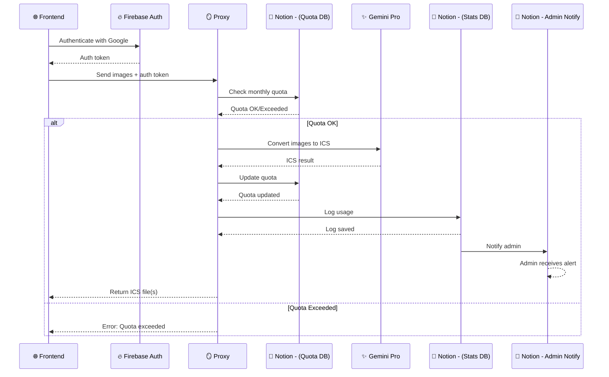
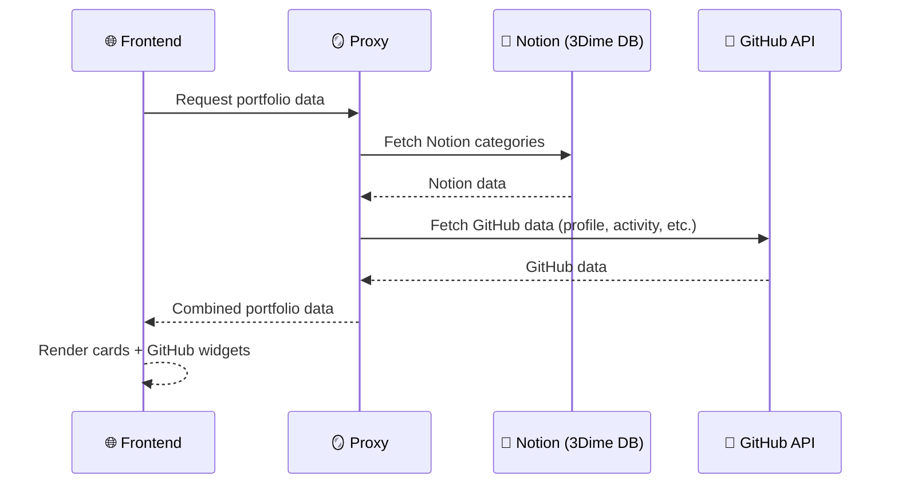

# 📐 System Architecture Documentation

> **Comprehensive technical and architectural overview of the 3dime-angular portfolio application**

This document provides a complete system architecture for the 3dime-angular portfolio, including frontend Angular application, backend Firebase Functions, data flow, caching strategies, authentication, and deployment architecture.

## Table of Contents

1. [System Overview](#-1-system-overview)
2. [Technology Stack](#-2-technology-stack)
3. [Frontend Architecture](#-3-frontend-architecture)
4. [Backend Architecture](#-4-backend-architecture)
5. [Data Flow & State Management](#-5-data-flow--state-management)
6. [Authentication & Security](#-6-authentication--security)
7. [Caching Architecture](#-7-caching-architecture)
8. [Deployment Architecture](#-8-deployment-architecture)
9. [Feature-Specific Architectures](#-9-feature-specific-architectures)

---

# 🌟 1. System Overview

The 3dime-angular portfolio is a modern, high-performance personal portfolio application built with Angular 20.3+. It features an AI-powered Calendar Converter alongside traditional portfolio sections, all presented with a stunning space-themed design.

## High-Level Architecture

```
┌─────────────────────────────────────────────────────────────────────────┐
│                            End Users                                     │
│                    (Web, Mobile, Desktop PWA)                           │
└────────────────────────────┬────────────────────────────────────────────┘
                             │
                             │ HTTPS
                             ▼
┌─────────────────────────────────────────────────────────────────────────┐
│                       Firebase Hosting / CDN                             │
│                    (Static Assets, Service Worker)                       │
└────────────────────────────┬────────────────────────────────────────────┘
                             │
                             │ Loads
                             ▼
┌─────────────────────────────────────────────────────────────────────────┐
│                     Angular 20.3+ Frontend                               │
│  ┌──────────────┐  ┌──────────────┐  ┌──────────────┐                 │
│  │  Components  │  │   Services   │  │   Routing    │                 │
│  │  - Profile   │  │  - GitHub    │  │  - Guards    │                 │
│  │  - Converter │  │  - Notion    │  │  - Resolvers │                 │
│  │  - Portfolio │  │  - Theme     │  │              │                 │
│  │  - Contact   │  │  - Converter │  │              │                 │
│  └──────────────┘  └──────────────┘  └──────────────┘                 │
└────────────────────────────┬────────────────────────────────────────────┘
                             │
                             │ HTTP/HTTPS API Calls
                             ▼
┌─────────────────────────────────────────────────────────────────────────┐
│                    Firebase Cloud Functions                              │
│  ┌──────────────────────────────────────────────────────────────────┐  │
│  │  API Proxy Layer (proxyApi)                                      │  │
│  │  - GitHub Integration  - Notion Integration                      │  │
│  │  - Converter (AI)      - Statistics                              │  │
│  │  - Quota Management    - Social Links                            │  │
│  └──────────────────────────────────────────────────────────────────┘  │
│                             │                                             │
│                             │ Cache Layer                                │
│                             ▼                                             │
│  ┌──────────────────────────────────────────────────────────────────┐  │
│  │  Firestore Cache (TTL-based)                                     │  │
│  │  - github-cache     - notion-cache                               │  │
│  │  - stats-cache      - Background refresh                         │  │
│  └──────────────────────────────────────────────────────────────────┘  │
└────────────────────────────┬────────────────────────────────────────────┘
                             │
                             │ External API Calls
                             ▼
┌─────────────────────────────────────────────────────────────────────────┐
│                      External Services                                   │
│  ┌──────────────┐  ┌──────────────┐  ┌──────────────┐                 │
│  │  GitHub API  │  │  Notion API  │  │  OpenAI API  │                 │
│  │  (GraphQL +  │  │ (DataSources)│  │  (GPT-4o)    │                 │
│  │   REST)      │  │              │  │              │                 │
│  └──────────────┘  └──────────────┘  └──────────────┘                 │
└─────────────────────────────────────────────────────────────────────────┘
```

## Key Characteristics

- **Modern Angular Stack**: Standalone components, TypeScript strict mode, RxJS for reactive programming
- **Progressive Web App**: Installable, offline-capable, share target integration
- **Serverless Backend**: Firebase Functions for API proxy and AI processing
- **Intelligent Caching**: Firestore-based caching with background refresh
- **AI Integration**: OpenAI GPT-4 Vision for calendar event extraction
- **Space-Themed UI**: Glassmorphism effects with modern CSS features

---

# 🛠️ 2. Technology Stack

## Request Flow Patterns

### Pattern 1: Standard API Request (with Cache)

```
User Action → Component → Service → Firebase Function → Cache Check
                                                              │
                                                              ├─ Hit → Return Cached Data (< 100ms)
                                                              │        └─ Background Refresh if Stale
                                                              │
                                                              └─ Miss → External API Call (2-5s)
                                                                        └─ Store in Cache
                                                                        └─ Return Fresh Data
```

### Pattern 2: Authenticated Request (Converter)

```
User Upload → Converter Component → Auth Service → Get ID Token
                                                         │
                                                         ▼
                                            Firebase Function (with token)
                                                         │
                                                         ├─ Verify Token
                                                         ├─ Check Quota (Notion)
                                                         ├─ Process with AI (OpenAI)
                                                         ├─ Update Quota
                                                         ├─ Log Usage
                                                         └─ Return ICS
```

### Pattern 3: PWA Offline Access

```
User Request → Service Worker Intercept
                       │
                       ├─ Network Available → Fetch from Network
                       │                      └─ Update Cache
                       │
                       └─ Network Unavailable → Serve from Cache
                                               └─ Show Offline UI
```

## State Flow Diagram

```
┌──────────────────────────────────────────────────────────────┐
│                     Application State                         │
├──────────────────────────────────────────────────────────────┤
│                                                               │
│  UI State (Component Level)                                  │
│  ├─ menuOpen: boolean                                        │
│  ├─ loading: boolean                                         │
│  └─ editingEvent: CalendarEvent | null                       │
│                                                               │
│  Shared State (Service Level)                                │
│  ├─ theme$: BehaviorSubject<string>                          │
│  ├─ user$: BehaviorSubject<User | null>                      │
│  └─ quotaStatus$: BehaviorSubject<QuotaInfo>                 │
│                                                               │
│  Cached State (HTTP with shareReplay)                        │
│  ├─ profile$: Observable<GithubUser>                         │
│  ├─ commits$: Observable<CommitData[]>                       │
│  └─ stuff$: Observable<Record<string, any[]>>                │
│                                                               │
│  Persisted State (localStorage)                              │
│  ├─ theme: 'glass' | 'dark' | 'white'                        │
│  ├─ background: 'video' | 'black' | 'white'                  │
│  └─ fontSize: 'normal' | 'large' | 'small'                   │
│                                                               │
└──────────────────────────────────────────────────────────────┘
```

---

# 🔐 6. Authentication & Security

## Firebase Authentication Flow

```
┌─────────────┐
│   User      │
│  Clicks     │
│ "Sign In"   │
└──────┬──────┘
       │
       ▼
┌─────────────────────────────────────────┐
│   Auth Service (Frontend)                │
│   - signInWithGoogle()                   │
│   - Opens Google OAuth popup             │
└──────┬──────────────────────────────────┘
       │
       ▼
┌─────────────────────────────────────────┐
│   Firebase Auth                          │
│   - Validates Google credentials         │
│   - Issues ID token (JWT)                │
└──────┬──────────────────────────────────┘
       │
       ▼
┌─────────────────────────────────────────┐
│   Frontend receives UserCredential       │
│   - Store user in auth service           │
│   - Get ID token: user.getIdToken()      │
└──────┬──────────────────────────────────┘
       │
       ▼
┌─────────────────────────────────────────┐
│   Send request to converter function     │
│   - Authorization: Bearer <id_token>     │
└──────┬──────────────────────────────────┘
       │
       ▼
┌─────────────────────────────────────────┐
│   Backend verifies token                 │
│   - admin.auth().verifyIdToken(token)    │
│   - Extract user ID and email            │
└──────┬──────────────────────────────────┘
       │
       ▼
┌─────────────────────────────────────────┐
│   Process authenticated request          │
│   - Check quota for user                 │
│   - Process conversion                   │
│   - Track usage                          │
└─────────────────────────────────────────┘
```

## Security Measures

### Frontend Security

| Measure | Implementation |
|---------|---------------|
| **HTTPS Only** | Enforced by Firebase Hosting |
| **CSP Headers** | Content Security Policy configured |
| **XSS Prevention** | Angular's built-in sanitization |
| **CORS** | Restricted to specific origins |
| **Environment Variables** | Sensitive data in environment files (not committed) |

### Backend Security

| Measure | Implementation |
|---------|---------------|
| **Token Verification** | Firebase Admin SDK verifies all ID tokens |
| **Rate Limiting** | Quota system prevents abuse |
| **API Keys** | Stored as Firebase secrets, never exposed |
| **Input Validation** | Request body validation before processing |
| **Error Handling** | Generic error messages to prevent info leakage |

### API Key Management

```
Development:
  - .env.example (template)
  - .env (local, gitignored)

Production:
  - Firebase secrets: firebase functions:config:set
  - GitHub Actions secrets: FIREBASE_*, OPENAI_API_KEY
  - Environment variables injected at build time
```

## Quota System (Notion-based)

Prevents abuse of AI conversion feature:

1. **User limits stored in Notion database**
   - Monthly conversion quota per user
   - Tracked by Firebase User ID

2. **Quota check before processing**
   ```typescript
   const quota = await notion.databases.query({
     filter: { property: 'UserID', equals: userId }
   });
   if (quota.conversions >= quota.limit) {
     throw new Error('Monthly quota exceeded');
   }
   ```

3. **Automatic tracking**
   - Each conversion increments counter
   - Notion automation notifies admin on high usage

---

# 💾 7. Caching Architecture

## Multi-Layer Caching Strategy

```
┌────────────────────────────────────────────────────────────────┐
│                    Layer 1: Browser Cache                       │
│                    (Service Worker)                             │
│  - Static assets (JS, CSS, images): 1 year                     │
│  - HTML: Network-first, fallback to cache                      │
│  - API responses: Not cached (handled by Layer 2)              │
└────────────────────────┬───────────────────────────────────────┘
                         │
                         ▼
┌────────────────────────────────────────────────────────────────┐
│                    Layer 2: RxJS shareReplay                    │
│                    (Frontend Services)                          │
│  - Duration: Session lifetime                                  │
│  - Scope: Single page load                                     │
│  - Benefits: Prevents duplicate HTTP requests                  │
└────────────────────────┬───────────────────────────────────────┘
                         │
                         ▼
┌────────────────────────────────────────────────────────────────┐
│                    Layer 3: Firestore Cache                     │
│                    (Backend Functions)                          │
│  - TTL: 1 hour (most), 5 min (statistics)                     │
│  - Scope: Global, all users                                    │
│  - Benefits: Fast response, reduced external API calls         │
└────────────────────────┬───────────────────────────────────────┘
                         │
                         ▼
┌────────────────────────────────────────────────────────────────┐
│                    External APIs                                │
│  - GitHub API, Notion API, OpenAI API                          │
└────────────────────────────────────────────────────────────────┘
```

## Firestore Cache Implementation

Detailed documentation: [`functions/CACHING.md`](functions/CACHING.md)

### Cache Manager

```typescript
class CacheManager<T> {
  constructor(options: {
    collection: string;    // Firestore collection
    key: string;          // Document ID
    ttl: number;          // Time-To-Live in ms
    forceCooldown?: number; // Min time between force refreshes
  });
  
  async get(
    fetchFn: () => Promise<T>,      // Function to fetch fresh data
    versionFn: (data: T) => string, // Version hashing function
    forceRefresh: boolean           // Force refresh flag
  ): Promise<T>;
}
```

### Cache Configuration

| Endpoint | Collection | Key | TTL | Purpose |
|----------|-----------|-----|-----|---------|
| `githubCommits` | `github-cache` | `commits-{months}` | 1h | GitHub activity |
| `githubSocial` | `github-cache` | `profile` / `social-links` | 1h | Profile data |
| `notionFunction` | `notion-cache` | `data` | 1h | Portfolio content |
| `statisticsFunction` | `stats-cache` | `statistics` | 5m | Usage stats |

### Cache Behavior

**Cache Hit (Fresh)**
```
Request → Check Firestore → Found & Fresh → Return Immediately (< 100ms)
```

**Cache Hit (Stale)**
```
Request → Check Firestore → Found but Stale
                                   │
                                   ├─ Return Cached Data (< 100ms)
                                   └─ Background Refresh
                                       └─ Update cache if data changed
```

**Cache Miss**
```
Request → Check Firestore → Not Found → Fetch from API (2-5s)
                                        └─ Store in Cache
                                        └─ Return Fresh Data
```

## Performance Impact

| Metric | Before Caching | After Caching | Improvement |
|--------|---------------|---------------|-------------|
| **Response Time** | 2-5s | < 100ms | **20-50x faster** |
| **API Calls/hour** | ~3,600 | 1-2 | **99.9% reduction** |
| **User Experience** | Slow initial load | Instant | **Perceived instant** |

---

# 🚀 8. Deployment Architecture

## CI/CD Pipeline

### GitHub Actions Workflows

```
.github/workflows/
├── qodana_code_quality.yml # Code quality analysis
├── update-screenshot.yml   # Automated screenshot updates
├── release.yml            # Release automation
├── labeler.yml            # PR labeling
└── summary.yml            # PR summary generation
```

### Deployment Flow

```
┌─────────────┐
│  Developer  │
│  Manually   │
│   Deploys   │
└──────┬──────┘
       │
       ▼
┌─────────────────────────────────────┐
│  Build Application Locally          │
│  - npm run build --configuration    │
│    production                       │
│  - Output: dist/3dime-angular/      │
└──────┬──────────────────────────────┘
       │
       ▼
┌─────────────────────────────────────┐
│  Deploy to Hosting                  │
│  - Firebase Hosting                 │
│    firebase deploy --only hosting   │
│  - Manual FTP/SFTP upload           │
│  - Other static hosting (Netlify,   │
│    Vercel, GitHub Pages)            │
└─────────────────────────────────────┘
```

### Deployment Targets

#### Production (3dime.com)

| Component | Deployment Method | Hosting |
|-----------|------------------|---------|
| **Frontend** | Manual deployment via Firebase CLI or static hosting | CDN-backed |
| **Functions** | `firebase deploy --only functions` | Firebase Cloud Functions |
| **Firestore** | Automatic (managed service) | Firebase Firestore |
| **Auth** | Automatic (managed service) | Firebase Authentication |

#### Development

```bash
# Local development server
npm start  # http://localhost:4200

# Firebase emulators (Functions, Firestore, Auth)
npm run dev  # Emulators on localhost
```

## Environment Configuration

### Frontend Environments

```typescript
// src/environments/environment.ts (development)
export const environment = {
  production: false,
  apiUrl: 'http://localhost:5001/project/region/proxyApi',
  firebase: { /* config */ }
};

// src/environments/environment.prod.ts (production)
export const environment = {
  production: true,
  apiUrl: 'https://us-central1-project.cloudfunctions.net/proxyApi',
  firebase: { /* config */ }
};
```

### Backend Configuration

```bash
# Firebase Functions configuration
firebase functions:config:set \
  openai.api_key="sk-..." \
  github.token="ghp_..." \
  notion.token="secret_..."

# Access in code
const apiKey = functions.config().openai.api_key;
```

## Hosting Architecture

```
┌─────────────────────────────────────────────────────────────┐
│                        DNS (3dime.com)                       │
│                              │                               │
│                              ▼                               │
│  ┌───────────────────────────────────────────────────────┐  │
│  │           Firebase Hosting / CDN                      │  │
│  │  - SSL/TLS automatic (Let's Encrypt)                  │  │
│  │  - Global CDN with edge locations                     │  │
│  │  - Serves static files from dist/                     │  │
│  │  - Service Worker caching                             │  │
│  └────────────────┬──────────────────────────────────────┘  │
│                   │                                          │
│                   ├─ /index.html                             │
│                   ├─ /assets/*                               │
│                   ├─ /*.js, /*.css                           │
│                   └─ Service Worker (ngsw-worker.js)         │
│                                                              │
└──────────────────────────────────────────────────────────────┘

┌─────────────────────────────────────────────────────────────┐
│              Firebase Cloud Functions                        │
│  - Automatic scaling                                         │
│  - Regional deployment (us-central1)                         │
│  - API endpoints:                                            │
│    • proxyApi (main router)                                  │
│    • converter (AI processing)                               │
└─────────────────────────────────────────────────────────────┘
```

---

# 🎯 9. Feature-Specific Architectures

## Calendar Converter - AI System Design

The **Converter module** allows users to authenticate, convert images into ICS events via Gemini Pro, track their usage quotas, and trigger admin notifications.

## 🔎 High-Level Flow

1. User authenticates using **Firebase Auth**.
2. Frontend sends images + auth token to the **Proxy**.
3. Proxy checks the monthly quota via **Notion**.
4. If quota is valid → Proxy sends images to **Gemini Pro** to generate ICS event(s).
5. Proxy updates user quota in Notion.
6. Proxy logs usage in Notion.
7. Notion automatically notifies the assigned Admin.

---

## 🧩 Converter — Sequence Diagram



---

## Portfolio Data Integration

The **Portfolio module** retrieves both GitHub and Notion data through the Proxy and displays it in the frontend as cards and widgets.

## 🔎 High-Level Flow

1. Frontend requests portfolio data from the **Proxy**.
2. Proxy fetches content categories from **Notion (3Dime DB)**.
3. Proxy fetches:

  * GitHub activity heatmap
  * GitHub profile data
  * GitHub social links
  * GitHub repo metadata (releases, etc.)
4. Proxy merges Notion + GitHub data.
5. Frontend renders all cards and components.

### 🔄 Firestore Cache

The proxy uses **Firestore** to cache all portfolio-related data.
This reduces the number of calls to GitHub and Notion APIs, prevents hitting rate limits, and improves load times.
Cached entries follow a TTL-based invalidation strategy.

---

## 🧩 Portfolio — Sequence Diagram



---

## Complete Technology Stack

### Frontend Stack

| Category | Technology | Version | Purpose |
|----------|-----------|---------|---------|
| **Framework** | Angular | 20.3.10 | Core application framework with standalone components |
| **Language** | TypeScript | 5.9.3 | Type-safe development |
| **Reactive Programming** | RxJS | 7.8.2 | Observable streams and async operations |
| **Styling** | SCSS | - | Component styling with CSS custom properties |
| **UI Components** | Bootstrap | 5.3.8 | UI component library |
| **Build Tool** | Angular CLI | 20.3.9 | Build system with esbuild bundler |
| **PWA** | @angular/service-worker | 20.3.9 | Progressive Web App capabilities |
| **PDF Processing** | PDF.js | 5.4.5 | PDF to image conversion |
| **Calendar Visualization** | cal-heatmap | 4.2.4 | GitHub activity heatmap |
| **Calendar Display** | FullCalendar | 6.1.16 | Event calendar rendering |
| **ICS Generation** | ical.js | 2.2.2 | iCalendar file format handling |

### Backend Stack

| Category | Technology | Version | Purpose |
|----------|-----------|---------|---------|
| **Runtime** | Node.js | 20+ | JavaScript runtime for Functions |
| **Cloud Functions** | Firebase Functions | 6.2.1 | Serverless backend API |
| **Authentication** | Firebase Auth | 12.5.1 | Google OAuth authentication |
| **Database** | Firestore | 12.5.1 | Cache storage and tracking |
| **AI Processing** | OpenAI API | 4.79.0 | GPT-4o Vision for calendar extraction |
| **HTTP Client** | Axios | 1.7.9 | HTTP requests to external APIs |

### External APIs

| Service | Purpose | Integration Type |
|---------|---------|------------------|
| **GitHub API** | Profile data, social links, commit activity | GraphQL + REST |
| **Notion API** | Portfolio content (stuff, recommendations) | DataSource API |
| **OpenAI GPT-4o** | Calendar event extraction from images/PDFs | REST API |

### Development Tools

| Tool | Purpose |
|------|---------|
| **ESLint** | Code linting with Angular-specific rules |
| **Prettier** | Code formatting |
| **Jasmine + Karma** | Unit testing framework |
| **Bruno** | API testing collections |
| **GitHub Actions** | CI/CD pipeline automation |

### Hosting & Deployment

| Service | Purpose |
|---------|---------|
| **Firebase Hosting** | Static file hosting with CDN |
| **Custom Domain** | 3dime.com with SSL/TLS |

---

# 🎨 3. Frontend Architecture

## Component Architecture

The application uses Angular 20.3+ standalone components with a modular, feature-based structure.

### Component Hierarchy

```
App (Root Component)
├── Profile Card
│   ├── Social Links
│   ├── Theme Switcher
│   └── Menu (Mobile)
├── About
├── Tech Stack
├── GitHub Activity
│   └── Cal-Heatmap Visualization
├── Experience
├── Education
├── Calendar Converter ⭐
│   ├── File Upload (Drag & Drop)
│   ├── Auth Gate (Firebase)
│   ├── File List
│   ├── Progress Tracker
│   ├── Event Editor
│   └── ICS Download
├── Stuff (Notion-powered)
├── Hobbies
├── Contact
└── Footer
```

### Directory Structure

```
src/app/
├── components/           # UI Components
│   ├── profile-card/    # Profile with social links
│   ├── about/           # About section
│   ├── tech-stack/      # Technologies showcase
│   ├── github-activity/ # Contribution heatmap
│   ├── experience/      # Work experience
│   ├── education/       # Academic background
│   ├── converter/       # AI Calendar Converter ⭐
│   ├── stuff/           # Recommendations
│   ├── hobbies/         # Personal interests
│   ├── contact/         # Contact info
│   └── footer/          # Footer section
├── services/            # Business Logic
│   ├── github.service.ts      # GitHub API integration
│   ├── notion.service.ts      # Notion API integration
│   ├── theme.service.ts       # Theme management
│   ├── converter.service.ts   # Calendar converter logic
│   └── auth.service.ts        # Firebase authentication
├── models/              # TypeScript interfaces
├── guards/              # Route guards
├── utils/               # Utility functions
├── constants/           # App constants
└── app.ts              # Root component
```

## Service Layer

### Core Services

```typescript
// GitHub Service - Profile and activity data
export class GithubService {
  getProfile(): Observable<GithubUser>
  getSocialLinks(): Observable<SocialLink[]>
  getCommitsV2(): Observable<CommitData[]>
}

// Notion Service - Portfolio content
export class NotionService {
  getStuff(): Observable<Record<string, any[]>>
}

// Theme Service - Appearance management
export class ThemeService {
  getCurrentTheme(): string
  cycleTheme(): string
  toggleBackground(): string
  cycleFontSize(): string
}

// Converter Service - AI calendar processing
export class ConverterService {
  convertToCalendar(files: File[], token: string): Observable<ConversionResult>
  downloadICS(events: CalendarEvent[], filename: string): void
}

// Auth Service - Firebase authentication
export class AuthService {
  signInWithGoogle(): Promise<UserCredential>
  signOut(): Promise<void>
  getIdToken(): Promise<string | null>
}
```

## State Management

The application uses a **service-based state management** approach with RxJS:

- **Local Component State**: Angular signals and properties for component-specific state
- **Shared State**: Services with BehaviorSubject/ReplaySubject for cross-component state
- **API Caching**: `shareReplay(1)` operator for HTTP request caching
- **Theme Persistence**: localStorage for theme preferences

```typescript
// Example: Theme Service State Management
@Injectable({ providedIn: 'root' })
export class ThemeService {
  private currentTheme$ = new BehaviorSubject<string>('glass');
  
  theme$ = this.currentTheme$.asObservable();
  
  cycleTheme(): string {
    const newTheme = this.getNextTheme();
    this.currentTheme$.next(newTheme);
    localStorage.setItem('theme', newTheme);
    return newTheme;
  }
}
```

## Routing Strategy

- **Hash-based routing** for compatibility with static hosting
- **Lazy loading** (potential future enhancement for converter module)
- **Route guards** for authentication-required features

## Styling Architecture

### CSS Custom Properties (Design Tokens)

```scss
:root {
  // Colors
  --text-primary: rgba(255, 255, 255, 0.95);
  --accent-color: #3b82f6;
  --glass-bg: rgba(255, 255, 255, 0.05);
  
  // Spacing
  --space-md: 1rem;
  --space-lg: 1.5rem;
  
  // Typography
  --font-size-base: 1.125rem;
  
  // Effects
  --glass-blur: blur(16px);
  --border-radius: 16px;
}
```

### Theming System

- **Glass Theme** (default): Translucent frosted-glass effect with space video background
- **Dark Theme**: Pure black background with high-contrast text
- **White Theme**: Clean white background for accessibility

---

# ⚙️ 4. Backend Architecture

## Firebase Functions Structure

```
functions/
├── src/
│   ├── index.ts              # Function exports
│   ├── proxies/              # API endpoint handlers
│   │   ├── converter.ts      # AI calendar conversion ⭐
│   │   ├── githubCommits.ts  # GitHub activity data
│   │   ├── githubSocial.ts   # GitHub profile/social
│   │   ├── notion.ts         # Notion content
│   │   ├── statistics.ts     # Usage statistics
│   │   └── quotaStatus.ts    # Quota checking
│   ├── services/             # Business logic
│   │   ├── quota.ts          # Notion-based quota management
│   │   └── tracking.ts       # Usage tracking
│   └── utils/                # Utilities
│       ├── cache.ts          # Cache management
│       └── firebase-admin.ts # Admin SDK setup
└── package.json
```

## API Endpoints

### Main Proxy Function (`proxyApi`)

Single HTTP function that routes requests based on `target` parameter:

```typescript
export const proxyApi = onRequest(async (req, res) => {
  const target = req.query.target;
  
  switch (target) {
    case 'profile':
    case 'social':
      return githubSocial(req, res);
    case 'commits':
      return githubCommits(req, res);
    case 'notion':
      return notionFunction(req, res);
    case 'statistics':
      return statisticsFunction(req, res);
    case 'quotaStatus':
      return quotaStatus(req, res);
    default:
      res.status(400).send('Invalid target');
  }
});
```

### Converter Function (`converter`)

Separate HTTPS function for AI-powered calendar conversion:

```typescript
export const converter = onRequest(async (req, res) => {
  // 1. Verify Firebase Auth token
  const user = await verifyIdToken(req);
  
  // 2. Check user quota (Notion API)
  const quota = await checkUserQuota(user.uid);
  if (quota.exceeded) return res.status(429).send('Quota exceeded');
  
  // 3. Process images with OpenAI GPT-4 Vision
  const events = await extractEventsFromImages(req.body.images);
  
  // 4. Update quota and log usage
  await updateQuota(user.uid);
  await logUsage(user.uid, events.length);
  
  // 5. Return ICS content
  res.json({ ics: generateICS(events) });
});
```

## External API Integration

### GitHub API

**GraphQL** for commit activity (efficient, single query):
```graphql
query($username: String!, $from: DateTime!, $to: DateTime!) {
  user(login: $username) {
    contributionsCollection(from: $from, to: $to) {
      contributionCalendar {
        weeks {
          contributionDays {
            date
            contributionCount
          }
        }
      }
    }
  }
}
```

**REST API** for profile and social links:
```
GET https://api.github.com/users/{username}
GET https://api.github.com/users/{username}/social_accounts
```

### Notion API

**DataSource API** for portfolio content:
```typescript
const notion = new Client({ auth: process.env.NOTION_TOKEN });
const response = await notion.databases.query({
  database_id: NOTION_DATABASE_ID,
  filter: { property: 'Status', status: { equals: 'Published' } }
});
```

### OpenAI API

**GPT-4o Vision** for calendar event extraction:
```typescript
const response = await openai.chat.completions.create({
  model: 'gpt-4o',
  messages: [
    {
      role: 'user',
      content: [
        { type: 'text', text: SYSTEM_PROMPT },
        { type: 'image_url', image_url: { url: imageBase64 } }
      ]
    }
  ]
});
```

---

# 🔄 5. Data Flow & State Management

---

# 📊 Performance Characteristics

## Build Metrics

| Metric | Value | Notes |
|--------|-------|-------|
| **Build Time** | ~14 seconds | Production build with optimization |
| **Bundle Size (Raw)** | 2.06 MB | Uncompressed JavaScript + CSS |
| **Transfer Size** | 479.12 kB | Compressed with gzip |
| **Initial Load** | < 3 seconds | On 3G connection |
| **Time to Interactive** | < 2 seconds | After initial load |

## Test Coverage

| Category | Count | Status |
|----------|-------|--------|
| **Unit Tests** | 100 tests | ✅ All passing |
| **Components** | ~15 components | Full coverage |
| **Services** | 5+ services | Full coverage |
| **Test Execution** | < 1 second | After build (14s) |

## Runtime Performance

### Frontend Performance

| Metric | Target | Actual |
|--------|--------|--------|
| **First Contentful Paint** | < 1.5s | ✅ ~1.2s |
| **Largest Contentful Paint** | < 2.5s | ✅ ~2.1s |
| **Time to Interactive** | < 3.5s | ✅ ~2.8s |
| **Cumulative Layout Shift** | < 0.1 | ✅ ~0.05 |

### Backend Performance

| Operation | Cold Start | Warm |
|-----------|-----------|------|
| **GitHub API (cached)** | ~150ms | < 100ms |
| **Notion API (cached)** | ~200ms | < 100ms |
| **Converter (AI)** | ~5-8s | ~3-5s |
| **Cache Hit** | N/A | < 50ms |

## Optimization Techniques

### Frontend Optimizations

- ✅ **OnPush Change Detection** - All components use OnPush strategy
- ✅ **TrackBy Functions** - Efficient list rendering with @for
- ✅ **Image Optimization** - WebP format with lazy loading
- ✅ **Code Splitting** - Lazy-loaded routes (future enhancement)
- ✅ **Tree Shaking** - Dead code elimination in production builds
- ✅ **Minification** - JavaScript and CSS minification
- ✅ **Compression** - Gzip compression on hosting

### Backend Optimizations

- ✅ **Firestore Caching** - TTL-based cache with background refresh
- ✅ **API Request Batching** - GraphQL for efficient GitHub queries
- ✅ **Connection Pooling** - Reused HTTP connections
- ✅ **Parallel Processing** - Concurrent image processing for converter
- ✅ **Rate Limiting** - Quota system prevents API abuse

---

# 🔍 Monitoring & Observability

## Logging Strategy

### Frontend Logging

```typescript
// Console logging for development
if (!environment.production) {
  console.log('[Component]', 'Action performed', data);
}

// Error tracking (future: integrate Sentry)
window.addEventListener('error', (event) => {
  // Log to error tracking service
});
```

### Backend Logging

```typescript
// Firebase Functions automatic logging
functions.logger.info('Cache hit', { key, age });
functions.logger.warn('API rate limit approaching', { remaining });
functions.logger.error('External API failed', { error, endpoint });
```

## Key Metrics to Monitor

### Application Health

| Metric | Tool | Threshold |
|--------|------|-----------|
| **Uptime** | Firebase Hosting | > 99.9% |
| **Error Rate** | Functions Logs | < 0.1% |
| **Response Time** | Cache metrics | < 200ms |
| **API Quota** | Notion tracking | < 80% |

### User Experience

| Metric | Measurement | Target |
|--------|-------------|--------|
| **Load Time** | Lighthouse | < 3s |
| **Bounce Rate** | Analytics | < 40% |
| **Session Duration** | Analytics | > 2min |
| **Conversion Rate** | Converter usage | Track trend |

### Infrastructure

| Metric | Source | Alert Threshold |
|--------|--------|----------------|
| **Function Errors** | Cloud Functions | > 5% error rate |
| **Firestore Reads** | Firebase Console | > 10K/day |
| **Firestore Writes** | Firebase Console | > 1K/day |
| **Cache Hit Rate** | Logs analysis | < 90% |

---

# 🔮 Future Architecture Considerations

## Scalability Enhancements

### Phase 1: Short-term (1-3 months)
- [ ] **Redis/Memcached** - Sub-10ms cache responses
- [ ] **CDN Optimization** - Edge caching for API responses
- [ ] **Image CDN** - Cloudinary or imgix integration
- [ ] **Analytics Integration** - Google Analytics 4 or Plausible

### Phase 2: Mid-term (3-6 months)
- [ ] **GraphQL Gateway** - Unified API layer
- [ ] **Real-time Updates** - WebSocket for live data
- [ ] **Multi-region Deployment** - Global edge functions
- [ ] **Database Optimization** - Indexes and query optimization

### Phase 3: Long-term (6-12 months)
- [ ] **Microservices** - Separate converter service
- [ ] **Kubernetes** - Container orchestration
- [ ] **Event-driven Architecture** - Message queues
- [ ] **A/B Testing Framework** - Feature flag system

## Architecture Evolution

### Current: Monolithic Frontend + Serverless Backend
```
Angular SPA → Firebase Functions → External APIs
```

### Future: Micro-Frontend + Microservices
```
┌──────────────────────────────────────────┐
│  Shell App (Main Portfolio)             │
├──────────────────────────────────────────┤
│  ┌────────────┐  ┌────────────┐         │
│  │ Converter  │  │ Analytics  │         │
│  │ Micro-App  │  │ Micro-App  │         │
│  └────────────┘  └────────────┘         │
└────────────┬─────────────────────────────┘
             │
             ▼
┌──────────────────────────────────────────┐
│  API Gateway (GraphQL Federation)        │
├──────────────────────────────────────────┤
│  ┌──────────┐  ┌──────────┐  ┌────────┐ │
│  │Converter │  │Portfolio │  │ Stats  │ │
│  │ Service  │  │ Service  │  │Service │ │
│  └──────────┘  └──────────┘  └────────┘ │
└──────────────────────────────────────────┘
```

---

# 📚 Additional Resources

## Related Documentation

- **[Component Architecture](docs/COMPONENTS.md)** - Detailed component documentation
- **[Services Documentation](docs/SERVICES.md)** - Service APIs and usage
- **[Design System](docs/DESIGN_SYSTEM.md)** - Styling and theming guide
- **[API Reference](docs/API.md)** - Backend API endpoints
- **[Calendar Converter](docs/CONVERTER.md)** - AI conversion feature details
- **[PWA Guide](docs/PWA.md)** - Progressive Web App features
- **[Caching Strategy](functions/CACHING.md)** - Backend caching implementation
- **[Backend Architecture](functions/ARCHITECTURE.md)** - Functions architecture details

## External References

- [Angular Documentation](https://angular.dev/) - Official Angular guide
- [Firebase Documentation](https://firebase.google.com/docs) - Firebase platform docs
- [OpenAI API Reference](https://platform.openai.com/docs) - GPT-4 Vision API
- [TypeScript Handbook](https://www.typescriptlang.org/docs/) - TypeScript guide
- [RxJS Documentation](https://rxjs.dev/) - Reactive programming with RxJS

---

# 🎯 Architecture Decision Records (ADRs)

## ADR-001: Standalone Components

**Decision**: Use Angular standalone components instead of NgModules

**Context**: Angular 20+ promotes standalone components as the modern approach

**Rationale**:
- Simpler mental model (no module management)
- Better tree-shaking and smaller bundles
- Easier lazy loading
- Future-proof (Angular's direction)

**Status**: ✅ Implemented

---

## ADR-002: Firebase for Backend

**Decision**: Use Firebase Cloud Functions for serverless backend

**Context**: Need scalable, low-maintenance backend for API proxy and AI processing

**Rationale**:
- Zero infrastructure management
- Automatic scaling
- Integrated authentication
- Pay-per-use pricing
- Quick deployment

**Status**: ✅ Implemented

---

## ADR-003: Firestore for Caching

**Decision**: Use Firestore instead of Redis/Memcached for caching

**Context**: Need fast caching layer without additional infrastructure

**Rationale**:
- No additional setup required (already using Firebase)
- Sufficient performance (< 100ms reads)
- Persistent cache (survives function cold starts)
- Simple TTL implementation
- Cost-effective for current scale

**Status**: ✅ Implemented

**Future**: Consider Redis for sub-10ms requirements

---

## ADR-004: OpenAI GPT-4o for Calendar Extraction

**Decision**: Use OpenAI GPT-4o Vision instead of alternatives (Google Gemini, AWS Rekognition)

**Context**: Need accurate extraction of calendar events from images

**Rationale**:
- Superior accuracy for complex layouts
- Natural language understanding
- Handles multiple date formats
- Multimodal (text + image)
- Well-documented API

**Trade-offs**:
- Higher cost per request
- External dependency

**Status**: ✅ Implemented

---

## ADR-005: Hash-based Routing

**Decision**: Use hash-based routing (#/) instead of PathLocationStrategy

**Context**: Deploying to static hosting (Firebase Hosting, FTP)

**Rationale**:
- Works on all static hosts without server configuration
- No need for URL rewriting rules
- Simpler deployment
- Compatible with GitHub Pages

**Trade-offs**:
- Less SEO-friendly URLs
- Visible # in URLs

**Status**: ✅ Implemented

---

# ⭐ Support the Project

If you find this work interesting or helpful, please consider giving the repository a **⭐ star** on GitHub!

---

**Last Updated**: 2025-11-20  
**Document Version**: 2.0  
**Architecture Version**: 3.1.x
