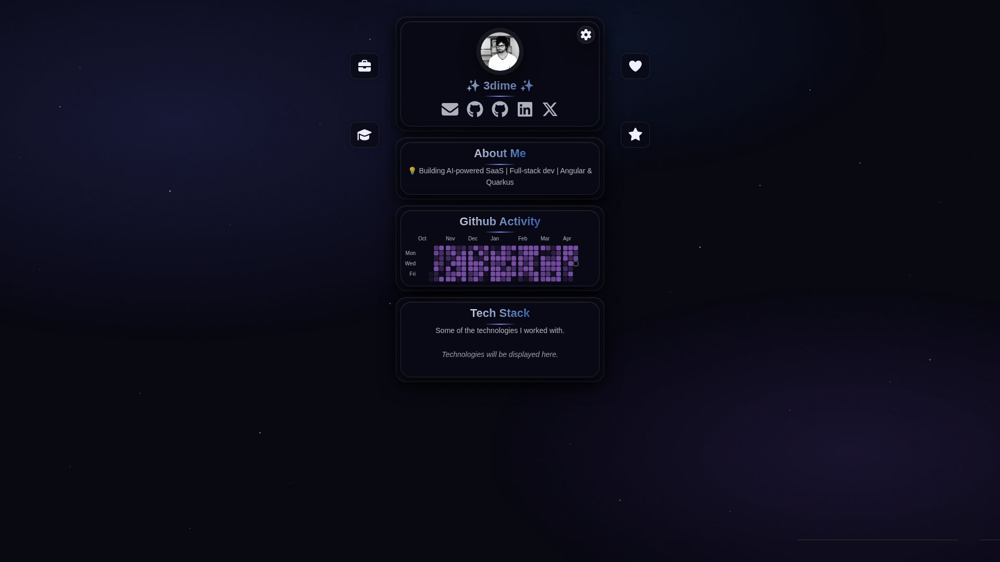
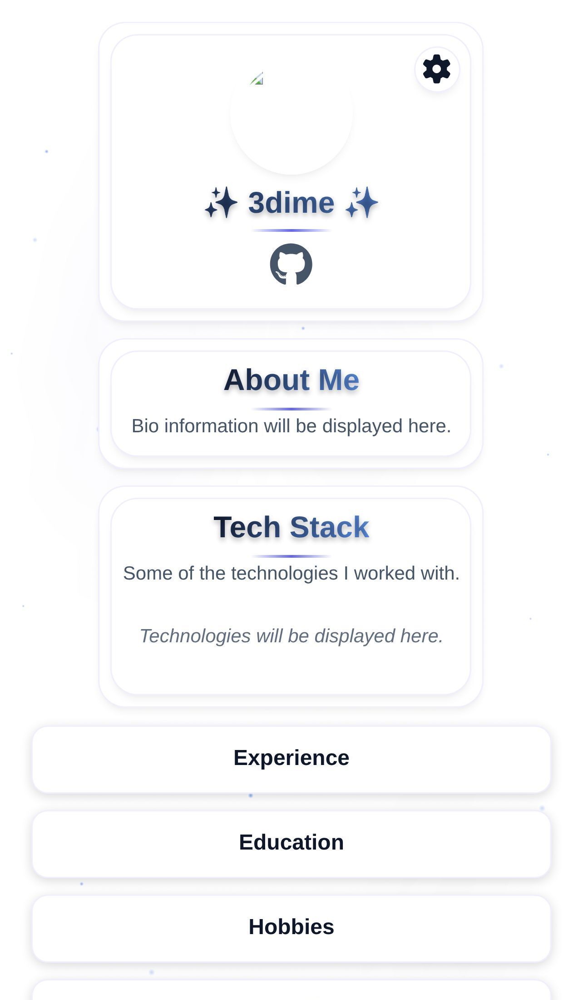

<div align="center">

# 🌟 3dime-angular


### ✨ Modern Personal Portfolio with AI-Powered Calendar Converter ✨

*A sophisticated Angular 20+ application featuring an AI-powered image/PDF to calendar conversion tool, alongside professional portfolio sections with a beautiful space-themed design*

[](https://3dime.com)
[](https://angular.dev)
[](https://www.typescriptlang.org/)
[](LICENSE)
[](public/assets/manifest.json)

---

</div>

## 🎯 Overview

3dime-angular is a modern, high-performance personal portfolio application built with Angular 20.3+. The standout feature is an **AI-powered Calendar Converter** that transforms images and PDFs containing calendar information into downloadable ICS files using GPT-4 Vision.

Beyond the converter, it showcases professional experience, technical skills, and personal interests with a stunning space-themed design featuring glassmorphism effects.

**Key Technologies**: Angular 20.3+ standalone components, TypeScript 5.9+, OpenAI GPT-4 Vision, Firebase Functions, Progressive Web App capabilities.

## ✨ Key Features

### 📅 **AI Calendar Converter** (Spotlight Feature)

Transform images and PDFs into calendar events instantly!

- **🧠 GPT-4 Vision AI** - Intelligent extraction of dates, times, and event details
- **📤 Drag & Drop Upload** - Supports JPG, PNG, and PDF files
- **📦 Batch Processing** - Process multiple files with progress tracking
- **✏️ Event Editing** - Edit or delete events before downloading
- **📄 PDF Support** - Automatic PDF-to-image conversion using PDF.js
- **📅 ICS Export** - Download calendar files compatible with Google Calendar, Outlook, Apple Calendar
- **🔐 Secure Authentication** - Firebase Google Sign-In for API access
- **📱 PWA Share Target** - Share images from other apps directly to the converter

**[📖 Full Converter Documentation →](docs/CONVERTER.md)**

### 🎨 **Modern Portfolio Design**
- **Glassmorphism UI** - Stunning frosted glass effects with space-themed aesthetics
- **Responsive Layout** - Flawless experience across all devices
- **Smooth Animations** - Subtle micro-interactions and fluid transitions
- **PWA Ready** - Installable, works offline, app-like experience

### 🔗 **Portfolio Sections**
- **Profile Card** - Personal branding with social links
- **About** - Professional introduction
- **Tech Stack** - Skills and technologies showcase
- **GitHub Activity** - Live contribution visualization  
- **Experience & Education** - Work history and academic background
- **Stuff & Hobbies** - Recommendations and personal interests
- **Contact** - Professional contact information

## 🛠️ Technology Stack

| Category | Technologies |
|----------|-------------|
| **Frontend** | Angular 20.3, TypeScript 5.9, RxJS 7.8, SCSS |
| **AI Integration** | OpenAI GPT-4 Vision (gpt-4o), PDF.js for PDF processing |
| **Backend** | Firebase Functions (Node.js), Firebase Authentication |
| **PWA** | Service Worker, Web App Manifest, Offline Support |
| **Build Tools** | Angular CLI 20.3, esbuild, Karma + Jasmine |
| **Deployment** | Firebase Hosting, GitHub Actions CI/CD |
| **APIs** | Notion API, GitHub API, Firebase |

## 🚀 Quick Start

```bash
# Clone and install
git clone https://github.com/m-idriss/3dime-angular.git
cd 3dime-angular
npm install

# Start development server
npm start
# Open http://localhost:4200/

# Build for production
npm run build -- --configuration=production
```

### Prerequisites
- Node.js 20+
- npm 10+

**[📖 Detailed Setup Guide →](docs/INSTALLATION.md)**

## ⚙️ Configuration

### Customization

Customize the theme in `src/styles.scss` using CSS custom properties:

```scss
:root {
  --primary-color: #00d4aa;
  --accent-color: #3b82f6;
  --background: #000000;
  --glass-bg: rgba(255, 255, 255, 0.1);
}
```

Update content in component files under `src/app/components/`.

### Firebase Setup (Required for Calendar Converter)

1. Create Firebase project in [Firebase Console](https://console.firebase.google.com)
2. Enable Google authentication provider
3. Add Firebase config to environment files
4. Set OpenAI API key as Firebase secret

**[📖 Complete Setup Guide →](docs/FIREBASE_AUTH_SETUP.md)**

### PWA Features

- 📱 Installable on mobile and desktop
- 📤 Share images/PDFs from other apps to converter
- ⚡ Quick access shortcuts
- 🔄 Offline support

**[📖 PWA Installation Guide →](docs/PWA.md)**

## 🔒 Security

⚠️ **Never commit secrets, API keys, or credentials to the repository!**

- Use Firebase secrets for backend API keys
- Configure environment variables in deployment platform
- Restrict API keys to specific domains
- Store CI/CD secrets in GitHub repository settings

**[📖 Security Guidelines →](SECURITY.md)**

## 🌐 Deployment

### Quick Deploy

```bash
# Build for production
npm run build -- --configuration=production

# Deploy to Firebase
firebase deploy --only hosting
```

### Deployment Options
- **Static Hosting**: Netlify, Vercel, GitHub Pages, Firebase
- **Auto Deploy**: GitHub Actions (configured for FTP)
- **Server Configuration**: `.htaccess` and `_redirects` included automatically

**[📖 Complete Deployment Guide →](docs/DEPLOYMENT.md)**

## 🧪 Testing

```bash
# Run unit tests (61 tests)
npm test

# Run in headless mode (CI)
CHROME_BIN=/usr/bin/google-chrome-stable npx ng test --browsers=ChromeHeadless --watch=false

# Run API tests with Bruno
bru run bruno-collections/3dime-api
```

**[📖 Complete Testing Guide →](docs/TESTING.md)**

## 📚 Documentation

### Essential Guides
- **[Installation Guide](docs/INSTALLATION.md)** - Complete setup instructions
- **[Deployment Guide](docs/DEPLOYMENT.md)** - Deploy to production
- **[Calendar Converter](docs/CONVERTER.md)** - AI conversion feature details
- **[PWA Guide](docs/PWA.md)** - Progressive Web App features

### Technical Docs
- **[Components](docs/COMPONENTS.md)** - Component architecture
- **[Services](docs/SERVICES.md)** - Service APIs
- **[Design System](docs/DESIGN_SYSTEM.md)** - Styling and theming
- **[API Reference](docs/API.md)** - Firebase Functions endpoints
- **[Testing Guide](docs/TESTING.md)** - Testing strategies

### Additional Resources
- **[Development Guidelines](docs/DEVELOPMENT.md)** - Workflow and best practices
- **[Contributing Guidelines](CONTRIBUTING.md)** - How to contribute
- **[Project Roadmap](ROADMAP.md)** - Future features and timeline
- **[Security Policy](SECURITY.md)** - Security guidelines

**[📖 Full Documentation Index →](docs/README.md)**

## 📸 Screenshots

<div align="center">

### 📅 AI Calendar Converter


*Transform images and PDFs into calendar events with AI-powered extraction*

### 📱 Mobile Experience



*Fully responsive design optimized for all devices*

> 📝 **Note**: Screenshots are automatically updated daily via GitHub Actions.

</div>


## 🏗️ Architecture

**Modern Angular Stack:**
- Standalone components with TypeScript strict mode
- RxJS for reactive data streams
- SCSS with CSS custom properties for theming
- Firebase Functions for AI processing backend
- Service Worker for PWA capabilities

**Project Structure:**
```
src/app/
├── components/          # UI components (converter, profile, etc.)
├── services/           # Data services (GitHub, Notion, converter)
├── models/             # TypeScript interfaces
└── app.ts              # Main application
```

**[📖 Detailed Architecture →](docs/COMPONENTS.md)**

## 📊 Performance

- ⚡ **Build Time**: ~14 seconds
- 📦 **Bundle Size**: 2.04 MB raw / 475 KB transferred
- 🧪 **Tests**: 61 tests, all passing ✅
- 🚀 **Load Time**: < 3 seconds on 3G
- ♿ **Accessibility**: WCAG AA compliant
- 🔍 **SEO**: Optimized meta tags

## 🤝 Contributing

Contributions are welcome! 

1. Fork the repository
2. Create a feature branch: `git checkout -b feature/amazing-feature`
3. Commit changes: `git commit -m '✨ Add amazing feature'`
4. Push and open a Pull Request

**[📖 Contributing Guidelines →](CONTRIBUTING.md)**

## 👨‍💻 Author

**Idriss Mohamady**

🌐 [3dime.com](https://3dime.com) • 💼 [LinkedIn](https://www.linkedin.com/in/i-mohamady/) • 🐙 [GitHub](https://github.com/m-idriss)

## 📄 License

MIT License - see [LICENSE](LICENSE) file for details.

## 🙏 Acknowledgments

- OpenAI for GPT-4 Vision API
- Angular team for the amazing framework
- Firebase for hosting and functions
- The open-source community

---

<div align="center">

**Made with ❤️ using Angular 20+ and TypeScript**

*Modern architecture • Space-themed design • Progressive Web App*

[](https://github.com/m-idriss/3dime-angular)
[](https://github.com/m-idriss)

</div>

