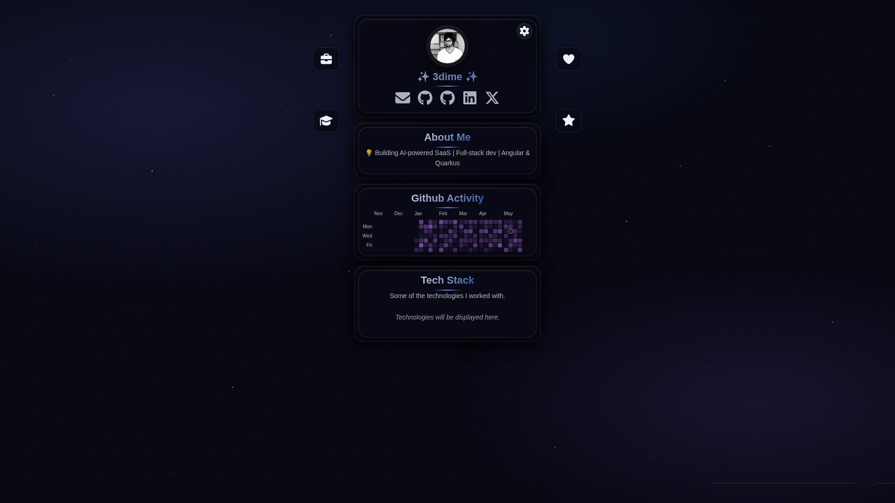
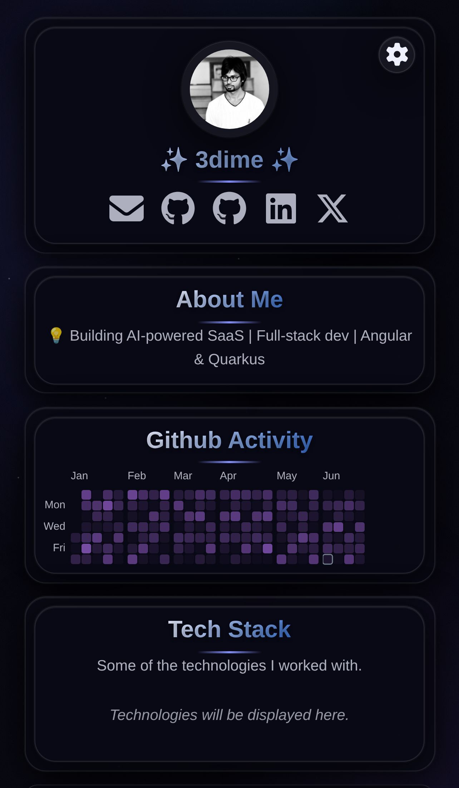

<div align="center">


# 3dime-angular

</div>

[](https://3dime.com)
[](https://angular.dev)
[](https://www.typescriptlang.org/)
[](LICENSE)
[](public/assets/manifest.json)

Modern personal portfolio built with Angular 20+ featuring a space-themed glassmorphism design. Showcases professional experience, tech stack, GitHub activity, and personal interests with drag & drop file upload, real-time updates, and PWA support.

Backend: [3dime-api](https://github.com/m-idriss/3dime-api) (Quarkus REST API)

## Quick Start

**Prerequisites:** Node.js 20+, npm 10+

```bash
npm install
npm start
# Open http://localhost:4200/
```

For Firebase setup (required for authentication): see [Firebase Auth Setup](docs/FIREBASE_AUTH_SETUP.md)

## Commands

```bash
npm start                                    # Dev server (http://localhost:4200)
npm test                                     # Unit tests
npm run build -- --configuration=production  # Production build
firebase deploy --only hosting               # Deploy to Firebase
```

## Project Structure

```
src/app/
├── components/    # UI components (profile, about, tech stack, converter, etc.)
├── services/      # Data services (GitHub, Notion, theme, auth)
├── models/        # TypeScript interfaces
└── app.ts         # Main application
```

## Documentation

| Document | Description |
|----------|-------------|
| [Architecture](docs/ARCHITECTURE.md) | System design and technical overview |
| [Installation](docs/INSTALLATION.md) | Detailed setup instructions |
| [Services](docs/SERVICES.md) | Service APIs and data management |
| [API Reference](docs/API.md) | Backend API endpoints |
| [Deployment](docs/DEPLOYMENT.md) | Production deploy and CI/CD |
| [Testing](docs/TESTING.md) | Unit tests, API tests, CI |
| [Firebase Auth](docs/FIREBASE_AUTH_SETUP.md) | Firebase authentication setup |
| [Screenshot Mode](docs/SCREENSHOT_MODE.md) | CI screenshot generation with mock data |
| [Roadmap](docs/ROADMAP.md) | Planned features and timeline |
| [Full Index](docs/README.md) | All documentation |

## 📸 Screenshots

<div align="center">

### 💼 Portfolio Homepage



*Modern portfolio showcasing experience, skills, and projects*

### 📱 Mobile Experience



*Fully responsive design optimized for all devices*

> 📝 **Note**: Screenshots are automatically updated daily via GitHub Actions with realistic mock data when external APIs are unavailable.

</div>

## Features

- **✨ Space-Themed Design** — Modern glassmorphism UI with smooth animations
- **🎨 Dark Mode Support** — Built-in dark/light theme switching
- **📱 Responsive Layout** — Mobile-first design that works on all devices
- **🔐 Authentication** — Firebase-based secure authentication
- **📊 GitHub Integration** — Display real-time GitHub profile stats and activity
- **💼 Project Portfolio** — Showcase your work and experience
- **⚡ Performance** — Optimized bundle size and fast load times
- **🔄 Real-time Updates** — Live data sync with backend services
- **📷 PWA Support** — Install as app on mobile devices
- **🎭 Mock Data Mode** — CI screenshots with realistic data

## Tech Stack

- **Framework:** Angular 20.3+
- **Language:** TypeScript 5.9
- **Styling:** SCSS with Angular Material
- **State Management:** RxJS & Services
- **Backend API:** Quarkus REST API (3dime-api)
- **Database:** Firebase + Firestore
- **Deployment:** Firebase Hosting
- **CI/CD:** GitHub Actions
- **Testing:** Jasmine & Karma

## License

MIT License - see [LICENSE](LICENSE) file for details.

## Author

**Idriss** — [3dime.com](https://3dime.com) | [@m-idriss](https://github.com/m-idriss)
