# 📐 System Design Documentation

# 🚀 System Design

This document provides a complete technical and architectural overview of the project, including both Converter and Portfolio modules.

---

# 🔐 1. Converter — System Design

The **Converter module** allows users to authenticate, convert images into ICS events via Gemini Pro, track their usage quotas, and trigger admin notifications.

## 🔎 High-Level Flow

1. User authenticates using **Firebase Auth**.
2. Frontend sends images + auth token to the **Proxy**.
3. Proxy checks the monthly quota via **Notion**.
4. If quota is valid → Proxy sends images to **Gemini Pro** to generate ICS event(s).
5. Proxy updates user quota in Notion.
6. Proxy logs usage in Notion.
7. Notion automatically notifies the assigned Admin.

---

## 🧩 Converter — Sequence Diagram

```mermaid
sequenceDiagram
    participant FE as 🌐 Frontend
    participant A as 🔥 Firebase Auth
    participant P as 🪞 Proxy
    participant NQ as 🧠 Notion - (Quota DB)
    participant GP as ✨ Gemini Pro
    participant NL as 🧠 Notion - (Stats DB)
    participant NN as 🔔 Notion - Admin Notify

    FE->>A: Authenticate with Google
    A-->>FE: Auth token

    FE->>P: Send images + auth token

    P->>NQ: Check monthly quota
    NQ-->>P: Quota OK/Exceeded

    alt Quota OK
        P->>GP: Convert images to ICS
        GP-->>P: ICS result

        P->>NQ: Update quota
        NQ-->>P: Quota updated

        P->>NL: Log usage
        NL-->>P: Log saved

        NL->>NN: Notify admin
        NN-->>NN: Admin receives alert

        P-->>FE: Return ICS file(s)
    else Quota Exceeded
        P-->>FE: Error: Quota exceeded
    end
```

---

# 🧑‍💻 2. Portfolio — System Design

The **Portfolio module** retrieves both GitHub and Notion data through the Proxy and displays it in the frontend as cards and widgets.

## 🔎 High-Level Flow

1. Frontend requests portfolio data from the **Proxy**.
2. Proxy fetches content categories from **Notion (3Dime DB)**.
3. Proxy fetches:

  * GitHub activity heatmap
  * GitHub profile data
  * GitHub social links
  * GitHub repo metadata (releases, etc.)
4. Proxy merges Notion + GitHub data.
5. Frontend renders all cards and components.

### 🔄 Firestore Cache

The proxy uses **Firestore** to cache all portfolio-related data.
This reduces the number of calls to GitHub and Notion APIs, prevents hitting rate limits, and improves load times.
Cached entries follow a TTL-based invalidation strategy.

---

## 🧩 Portfolio — Sequence Diagram

```mermaid
sequenceDiagram
    participant FE as 🌐 Frontend
    participant P as 🪞 Proxy
    participant N as 🧠 Notion (3Dime DB)
    participant G as 🐙 GitHub API

    FE->>P: Request portfolio data

    P->>N: Fetch Notion categories
    N-->>P: Notion data

    P->>G: Fetch GitHub data (profile, activity, etc.)
    G-->>P: GitHub data

    P-->>FE: Combined portfolio data
    FE-->>FE: Render cards + GitHub widgets
```

---

# 🏗️ Tech Stack Summary

| Component      | Technology                                       |
| -------------- | ------------------------------------------------ |
| Frontend       | Web / JavaScript                                 |
| Authentication | Firebase Auth (Google)                           |
| AI Conversion  | Gemini Pro                                       |
| Database       | Notion (Quota, Logs, Content), Firestore (Cache) |
| Proxy Layer    | Custom API Gateway / Cloud Functions             |
| External APIs  | GitHub API                                       |

---

# ⭐ Support the Project

If you find this work interesting or helpful, please consider giving the repository a **⭐ star** on GitHub!
